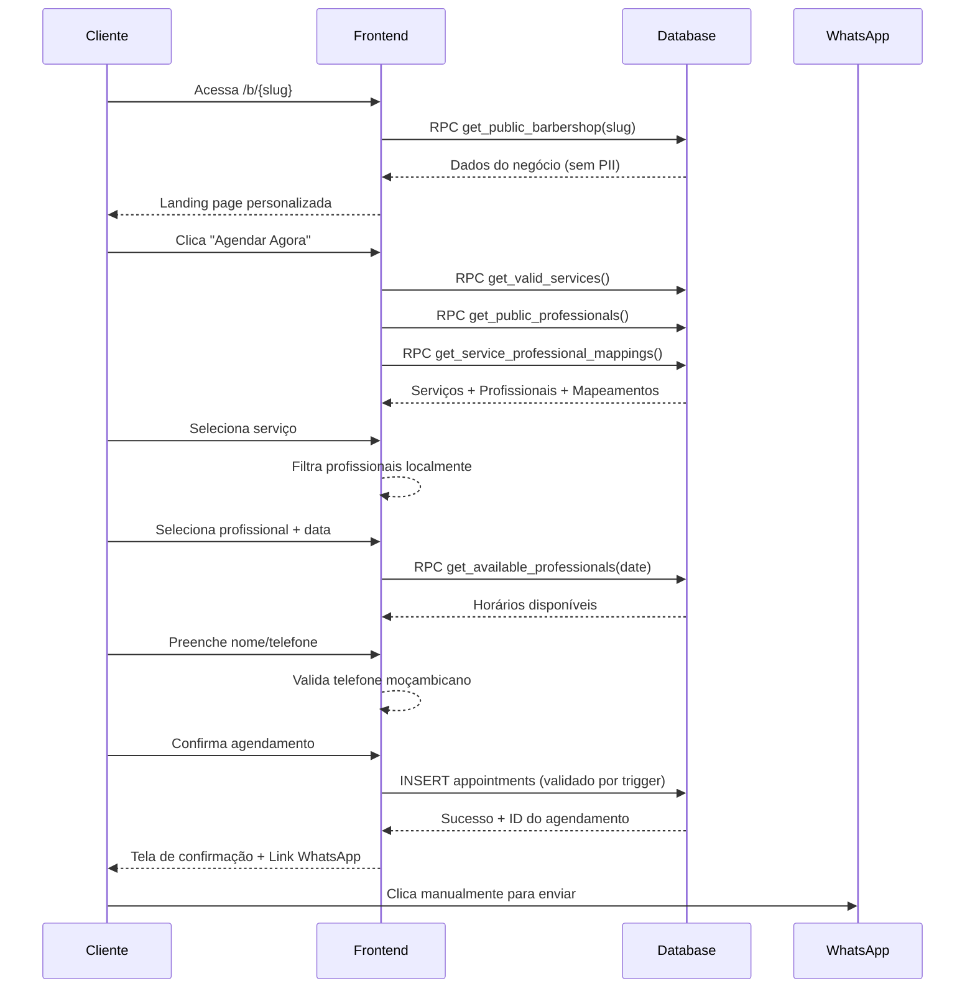

# 📋 BLUEPRINT COMPLETO DO SISTEMA DE AGENDAMENTO MULTI-TENANT

> **Versão:** 1.0  
> **Última atualização:** 16 de Janeiro de 2026  
> **Plataforma:** Lovable Cloud + Supabase

---

## Índice

1. [Visão Geral do Produto](#1️⃣-visão-geral-do-produto)
2. [Arquitetura Geral](#2️⃣-arquitetura-geral)
3. [Modelo de Usuários e Permissões](#3️⃣-modelo-de-usuários-e-permissões)
4. [Fluxos Principais](#4️⃣-fluxos-principais)
5. [Modelo de Dados](#5️⃣-modelo-de-dados)
6. [Segurança e RLS](#6️⃣-segurança-e-rls)
7. [Experiência do Cliente Final](#7️⃣-experiência-do-cliente-final)
8. [Configurações por Negócio](#8️⃣-configurações-por-negócio)
9. [Super Admin](#9️⃣-super-admin)
10. [Limitações e Decisões de Design](#🔟-limitações-e-decisões-de-design)

---

## 1️⃣ Visão Geral do Produto

### Objetivo
Sistema SaaS multi-tenant de agendamento online para estabelecimentos de beleza (barbearias, salões, híbridos) em Moçambique.

### Público-alvo
- **Donos de barbearias e salões de beleza** - Gestão completa do negócio
- **Gerentes de estabelecimentos** - Operações diárias delegadas
- **Profissionais (barbeiros/cabeleireiros)** - Agenda pessoal e presença
- **Clientes finais** - Agendamento rápido sem necessidade de login

### Problemas que Resolve
| Problema | Solução |
|----------|---------|
| Gestão manual de agendamentos via papel/WhatsApp | Sistema digital com calendário integrado |
| Falta de controle sobre presença dos profissionais | Módulo de marcação de presença diária |
| Ausência de histórico de clientes e finanças | Base de dados centralizada com relatórios |
| Dificuldade de personalização da marca | Temas customizáveis por estabelecimento |

### Tipo de Plataforma
**SaaS Multi-Tenant** com isolamento completo por `barbershop_id`

---

## 2️⃣ Arquitetura Geral

### Stack Tecnológico

```
┌─────────────────────────────────────────────────────────────┐
│                        FRONTEND                              │
├─────────────────────────────────────────────────────────────┤
│  React 18 + TypeScript + Vite                               │
│  TailwindCSS + shadcn/ui + Framer Motion                    │
│  React Router DOM + TanStack Query                          │
│  Design system com tokens semânticos HSL                    │
└─────────────────────────────────────────────────────────────┘
                              │
                              ▼
┌─────────────────────────────────────────────────────────────┐
│                   LOVABLE CLOUD (Supabase)                   │
├─────────────────────────────────────────────────────────────┤
│  PostgreSQL + Row Level Security (RLS)                      │
│  Edge Functions (Deno)                                      │
│  Storage (logos, backgrounds)                               │
│  Auth (email/password, auto-confirm)                        │
└─────────────────────────────────────────────────────────────┘
```

### Estratégia de Segurança

```
┌────────────────────────────────────────────────────────────┐
│                    CAMADAS DE SEGURANÇA                     │
├────────────────────────────────────────────────────────────┤
│  1. RLS em TODAS as tabelas sensíveis                      │
│  2. Funções SECURITY DEFINER para validações               │
│  3. Isolamento multi-tenant via barbershop_id              │
│  4. Bloqueio de SELECT anônimo em dados sensíveis          │
│  5. Dados públicos expostos APENAS via RPCs seguras        │
└────────────────────────────────────────────────────────────┘
```

---

## 3️⃣ Modelo de Usuários e Permissões

### Hierarquia de Roles

```
                    ┌─────────────────┐
                    │   SUPER ADMIN   │
                    │ (gumissanheelmer│
                    │  @gmail.com)    │
                    └────────┬────────┘
                             │
              ┌──────────────┴──────────────┐
              ▼                              ▼
     ┌─────────────────┐           ┌─────────────────┐
     │     ADMIN       │           │     ADMIN       │
     │  (Negócio A)    │           │  (Negócio B)    │
     └────────┬────────┘           └────────┬────────┘
              │                              │
     ┌────────┴────────┐           ┌────────┴────────┐
     ▼                  ▼           ▼                  ▼
┌─────────┐      ┌──────────┐ ┌─────────┐      ┌──────────┐
│ MANAGER │      │ BARBER   │ │ MANAGER │      │ BARBER   │
└─────────┘      └──────────┘ └─────────┘      └──────────┘
```

### Super Admin (`gumissanheelmer@gmail.com`)

| ✅ Pode | ❌ Não Pode |
|---------|-------------|
| Ver e gerenciar TODOS os estabelecimentos | Agendar como cliente |
| Aprovar/rejeitar/bloquear/ativar negócios | Modificar dados operacionais internos |
| Criar e gerenciar mensalidades | Acessar como admin de um negócio específico |
| Ver estatísticas globais da plataforma | - |

### Admin (Dono do Negócio)

| ✅ Pode | ❌ Não Pode |
|---------|-------------|
| Gerenciar profissionais, serviços, agendamentos | Acessar dados de outros estabelecimentos |
| Criar e gerenciar gerentes | Aprovar seu próprio negócio |
| Configurar personalização visual | Ver dashboard do Super Admin |
| Ver clientes e despesas | - |
| Definir horários e folgas dos profissionais | - |

### Gerente (Manager)

| ✅ Pode | ❌ Não Pode |
|---------|-------------|
| Tudo que o Admin pode (operacional) | Criar outros gerentes |
| Gerenciar profissionais e serviços | Modificar configurações do estabelecimento |
| Ver e editar agendamentos | Acessar aba de configurações |

**Condição de Acesso:** `active = true` E `status = 'active'`

### Profissional (Barber)

| ✅ Pode | ❌ Não Pode |
|---------|-------------|
| Ver seus próprios agendamentos | Ver agendamentos de outros profissionais |
| Marcar presença/ausência diária | Modificar serviços ou configurações |
| Contatar clientes via WhatsApp | Gerenciar outros profissionais |

**Condição de Acesso:** `approval_status = 'approved'` em `barber_accounts`

### Cliente (Sem login)

| ✅ Pode | ❌ Não Pode |
|---------|-------------|
| Ver serviços e profissionais disponíveis | Ver dados de outros clientes |
| Criar agendamentos (INSERT público) | Modificar ou cancelar agendamentos |
| Enviar confirmação via WhatsApp | Ver informações sensíveis do negócio |

---

## 4️⃣ Fluxos Principais

### Fluxo de Agendamento



### Fluxo de Registro de Negócio

```
1. Acessa /register
   └── Formulário em 3 etapas
       ├── Etapa 1: Dados do proprietário
       ├── Etapa 2: Dados do estabelecimento
       └── Etapa 3: Personalização visual

2. Cria conta de usuário (signUp)
   └── Auto-confirm habilitado

3. Upload de logo (opcional)
   └── Storage bucket 'logos'

4. Cria negócio via RPC create_barbershop
   └── approval_status = 'pending'
   └── active = false

5. Atribui role 'admin' com barbershop_id
   └── Tabela user_roles

6. Redireciona para /pending-approval
   └── Aguarda aprovação do Super Admin

7. Super Admin aprova
   └── approval_status = 'approved'
   └── active = true
```

### Fluxo de Registro de Profissional

```
1. Acessa /barber/register
   └── Formulário com validação Zod

2. Preenche dados + nome do estabelecimento
   └── Nome, telefone, email, senha

3. Cria conta auth + barber_accounts
   └── approval_status = 'pending'
   └── barbershop_id = NULL (preenchido após vinculação)

4. Admin vê em "Contas"
   └── Lista de solicitações pendentes

5. Admin aprova/vincula ao barbershop_id
   └── Trigger handle_barber_approval:
       ├── Cria entrada em 'barbers'
       ├── Atribui role 'barber'
       └── Vincula barber_id
```

### Fluxo de Login Unificado

```
                    ┌─────────────┐
                    │   /login    │
                    └──────┬──────┘
                           │
                    useAuth detecta roles
                           │
           ┌───────────────┼───────────────┐
           │               │               │
           ▼               ▼               ▼
    ┌──────────┐    ┌──────────┐    ┌──────────┐
    │ Super    │    │ Admin/   │    │ Barber   │
    │ Admin    │    │ Manager  │    │ Aprovado │
    └────┬─────┘    └────┬─────┘    └────┬─────┘
         │               │               │
         ▼               ▼               ▼
  /superadmin/     /admin/         /barber/
   dashboard       dashboard       dashboard

           ┌───────────────┼───────────────┐
           │               │               │
           ▼               ▼               ▼
    ┌──────────┐    ┌──────────┐    ┌──────────┐
    │ Barber   │    │ Manager  │    │ Sem role │
    │ Pendente │    │ Inativo  │    │ válida   │
    └────┬─────┘    └────┬─────┘    └────┬─────┘
         │               │               │
         ▼               ▼               ▼
    "Aguardando    "Aguardando     "Acesso não
     aprovação"     ativação"       autorizado"
```

### Fluxo WhatsApp (wa.me)

```
⚠️ RESTRIÇÃO CRÍTICA: Sem API externa

┌─────────────────────────────────────────────────────────┐
│  1. Sistema gera link wa.me com mensagem pré-formatada  │
│  2. Cliente CLICA MANUALMENTE no botão                  │
│  3. WhatsApp abre com mensagem pronta                   │
│  4. Cliente envia manualmente                           │
└─────────────────────────────────────────────────────────┘

Formato: https://wa.me/{numero}?text={mensagem_encodada}

Motivo: Evitar bloqueios da Meta por automação
```

---

## 5️⃣ Modelo de Dados

### Diagrama de Relacionamentos

```
┌─────────────────┐       ┌─────────────────┐
│   barbershops   │◄──────│     barbers     │
│                 │       │                 │
│ id (PK)         │       │ id (PK)         │
│ slug            │       │ barbershop_id   │
│ name            │       │ name            │
│ owner_email     │       │ working_hours   │
│ approval_status │       │ has_app_access  │
│ active          │       │ active          │
│ business_type   │       └────────┬────────┘
│ cores/logo      │                │
└────────┬────────┘                │
         │                         │
         │       ┌─────────────────┴─────────────────┐
         │       │                                   │
         ▼       ▼                                   ▼
┌─────────────────┐    ┌─────────────────┐    ┌─────────────────┐
│    services     │    │  appointments   │    │ barber_accounts │
│                 │    │                 │    │                 │
│ id (PK)         │    │ id (PK)         │    │ id (PK)         │
│ barbershop_id   │    │ barbershop_id   │    │ user_id         │
│ name            │    │ barber_id       │    │ barber_id       │
│ price           │    │ service_id      │    │ barbershop_id   │
│ duration        │    │ client_name     │    │ approval_status │
│ allowed_types   │    │ client_phone    │    └─────────────────┘
└────────┬────────┘    │ appointment_date│
         │             │ appointment_time│
         │             │ status          │
         │             └─────────────────┘
         │
         ▼
┌─────────────────────────┐
│  service_professionals  │
│                         │
│ service_id              │
│ professional_id         │
│ barbershop_id           │
└─────────────────────────┘
```

### Tabelas Principais

| Tabela | Descrição | Campos-chave |
|--------|-----------|--------------|
| `barbershops` | Estabelecimentos | id, slug, name, owner_email, approval_status, active, business_type |
| `barbers` | Profissionais | id, name, barbershop_id, working_hours, has_app_access, active |
| `services` | Serviços oferecidos | id, name, price, duration, barbershop_id, allowed_business_types |
| `service_professionals` | Vínculos serviço-profissional | service_id, professional_id, barbershop_id |
| `appointments` | Agendamentos | id, client_name, client_phone, barber_id, service_id, barbershop_id, date, time, status |
| `barber_accounts` | Contas de acesso dos barbeiros | id, user_id, barber_id, barbershop_id, approval_status |
| `managers` | Gerentes delegados | id, user_id, barbershop_id, status, active |
| `user_roles` | Roles de usuários | user_id, role (enum), barbershop_id |
| `subscriptions` | Mensalidades | id, barbershop_id, amount, due_date, status, paid_at |
| `expenses` | Despesas do negócio | id, barbershop_id, amount, category, expense_date |
| `professional_attendance` | Presença diária | barber_id, attendance_date, status |
| `professional_schedules` | Horários de trabalho | barber_id, day_of_week, start_time, end_time, is_working_day |
| `professional_time_off` | Folgas agendadas | barber_id, off_date, reason |

### Regras Críticas de Dados

```sql
-- Todas tabelas multi-tenant têm:
barbershop_id UUID NOT NULL

-- Vínculos com auth:
user_id UUID REFERENCES auth.users(id)

-- Ciclo de vida:
approval_status TEXT DEFAULT 'pending' -- pending/approved/rejected/blocked
active BOOLEAN DEFAULT true

-- Enum de roles:
CREATE TYPE app_role AS ENUM ('superadmin', 'admin', 'manager', 'barber');
```

---

## 6️⃣ Segurança e RLS

### Funções SECURITY DEFINER

```sql
-- Verificações de role
is_superadmin(uuid) → boolean
is_barbershop_admin(uuid, uuid) → boolean
is_barbershop_manager(uuid, uuid) → boolean
is_barbershop_staff(uuid, uuid) → boolean
has_role(uuid, app_role) → boolean

-- Helpers
get_user_barbershop_id(uuid) → uuid
can_view_client_data(uuid) → boolean
```

### RPCs Públicas Seguras (SECURITY DEFINER)

```sql
-- RPCs READ-ONLY (sem dados sensíveis)
get_public_barbershop(slug) → {id, name, cores, logo} -- SEM whatsapp, SEM owner_email
get_public_services(barbershop_id) → [{id, name, price, duration}]
get_public_professionals(barbershop_id) → [{id, name, specialty, working_hours}] -- SEM telefone
get_public_service_professionals(barbershop_id) → vínculos serviço-profissional
get_public_professional_schedules(barbershop_id) → horários de trabalho
get_public_professional_time_off(barbershop_id) → folgas
get_public_appointments_for_day(barber_id, date) → [{time, duration}] -- SEM dados do cliente
get_valid_services(barbershop_id) → serviços válidos para o tipo de negócio
get_available_professionals(barbershop_id, date) → com status de disponibilidade

-- RPC WRITE (INSERT seguro)
create_public_appointment(params) → {success, appointment_id, error}
  - Valida barbershop ativo/aprovado
  - Valida profissional ativo
  - Valida serviço ativo
  - Verifica conflitos de horário
  - Insere com SECURITY DEFINER

-- RPC para WhatsApp após agendamento
get_barbershop_whatsapp_for_appointment(appointment_id) → whatsapp_number
  - Retorna WhatsApp APENAS se appointment_id for válido
```

### Matriz de Políticas RLS

| Tabela | SELECT | INSERT | UPDATE | DELETE |
|--------|--------|--------|--------|--------|
| `appointments` | Staff autenticado | **Via RPC apenas** | Staff/Barber | Admin/Manager |
| `barbershops` | Admin/Manager do negócio | Authenticated (pending) | Admin | Admin |
| `barbers` | Staff do negócio | Admin/Manager | Admin/Manager | Admin/Manager |
| `services` | Público (active=true) | Admin/Manager | Admin/Manager | Admin/Manager |
| `barber_accounts` | Admin + próprio usuário | Próprio usuário | Admin/Manager | - |
| `managers` | Admin + próprio usuário | Admin | Admin | Admin |
| `subscriptions` | Admin (próprio) | Super Admin | Super Admin | Super Admin |
| `expenses` | Admin/Manager | Admin/Manager | Admin/Manager | Admin/Manager |

> ⚠️ **Nota:** INSERT público em `appointments` foi REMOVIDO. Agendamentos só podem ser criados via RPC `create_public_appointment`.

### Políticas de Bloqueio Anônimo

```sql
-- Aplicado em todas tabelas sensíveis:
CREATE POLICY "Block anonymous select on {table}"
ON public.{table}
FOR SELECT
TO anon
USING (false);

-- Tabelas protegidas:
✓ appointments
✓ barber_accounts
✓ barbers
✓ barbershops
✓ managers
✓ profiles
✓ expenses
✓ subscriptions
✓ user_roles
```

### Trigger de Validação de Agendamentos

```sql
-- validate_appointment()
-- Valida ANTES de inserir/atualizar:

1. Estabelecimento ativo e aprovado
2. Serviço ativo e compatível com business_type
3. Profissional ativo
4. Vínculo serviço-profissional (para salões/híbridos)
5. Conflito de horários
```

---

## 7️⃣ Experiência do Cliente Final

### Acesso Público

```
URL: /b/{slug}
Exemplo: /b/barbearia-premium
```

### O que o Cliente VÊ

| Elemento | Descrição |
|----------|-----------|
| Landing page | Marca personalizada (logo, cores, imagem de fundo) |
| Lista de serviços | Nome, preço e duração |
| Lista de profissionais | Filtrada por serviço (se aplicável) |
| Calendário | Apenas datas futuras com horários livres |
| Formulário simples | Apenas nome + telefone |

### O que o Cliente NÃO VÊ

- ❌ Outros agendamentos
- ❌ Dados de outros clientes
- ❌ Informações financeiras
- ❌ Área administrativa
- ❌ Emails/telefones dos profissionais

### Validação de Telefone (Moçambique)

```javascript
// Prefixos válidos: 82, 83, 84, 85, 86, 87
// Formato: +258 XX XXX XXXX

Vodacom: 84, 85
Movitel: 86, 87
Tmcel: 82, 83
```

### Fluxo de Finalização

```
1. Confirma agendamento
   └── Tela de sucesso com resumo

2. Botão "Enviar pelo WhatsApp"
   └── Abre link wa.me com mensagem formatada

3. Cliente clica MANUALMENTE para enviar
   └── Mensagem inclui: nome, serviço, profissional, data, hora, valor
```

---

## 8️⃣ Configurações por Negócio

### Personalização Visual

| Campo | Tipo | Descrição |
|-------|------|-----------|
| `primary_color` | HEX | Cor principal (botões, destaques) |
| `secondary_color` | HEX | Cor secundária (cards, borders) |
| `background_color` | HEX | Fundo da página |
| `text_color` | HEX | Cor do texto principal |
| `logo_url` | URL | Logo (bucket 'logos') |
| `background_image_url` | URL | Imagem de fundo (bucket 'backgrounds') |
| `background_overlay_level` | Enum | low / medium / high |

### Configurações Operacionais

| Campo | Tipo | Descrição |
|-------|------|-----------|
| `whatsapp_number` | String | Número para links wa.me |
| `opening_time` | Time | Horário de abertura global |
| `closing_time` | Time | Horário de fechamento global |
| `business_type` | Enum | barbearia / salao / salao_barbearia |

### Status e Ciclo de Vida

```
approval_status:
├── pending   → Aguardando aprovação
├── approved  → Aprovado e operacional
├── rejected  → Rejeitado (não pode operar)
└── blocked   → Bloqueado (suspensão)

active:
├── true   → Visível e operacional
└── false  → Oculto (manutenção/desativado)
```

### Mensalidades (Subscriptions)

| Campo | Descrição |
|-------|-----------|
| `plan_name` | mensal / trimestral / anual |
| `amount` | Valor em MZN |
| `due_date` | Data de vencimento |
| `status` | pending / paid / overdue |
| `paid_at` | Data do pagamento |
| `payment_method` | mpesa / emola / transferencia / dinheiro |

---

## 9️⃣ Super Admin

### Dashboard com 3 Abas

```
┌─────────────────────────────────────────────────────────────┐
│  📊 Dashboard  │  🏢 Empresas  │  💳 Mensalidades           │
├─────────────────────────────────────────────────────────────┤
│                                                             │
│  DASHBOARD:                                                 │
│  ├── Cards de métricas globais                             │
│  ├── Gráficos Recharts (empresas/receita)                  │
│  └── Status breakdown (pending/approved/blocked)           │
│                                                             │
│  EMPRESAS:                                                  │
│  ├── Lista com filtros por status                          │
│  ├── Ações: Aprovar / Rejeitar / Bloquear / Ativar        │
│  └── Ver detalhes e mensalidades                           │
│                                                             │
│  MENSALIDADES:                                              │
│  ├── Criar nova cobrança                                   │
│  ├── Marcar como pago                                      │
│  └── Filtrar por negócio/status                            │
│                                                             │
└─────────────────────────────────────────────────────────────┘
```

### Controla

- ✅ Ciclo de vida de todos os negócios
- ✅ Registro financeiro de mensalidades
- ✅ Estatísticas globais da plataforma

### Não Interfere

- ❌ Dados operacionais internos (agendamentos, serviços)
- ❌ Configurações visuais dos negócios
- ❌ Gestão de profissionais

### Atribuição Automática

```sql
-- Trigger assign_superadmin_role
-- Atribui role 'superadmin' automaticamente para:
-- gumissanheelmer@gmail.com
```

---

## 🔟 Limitações e Decisões de Design

### Propositalmente NÃO Implementado

| Feature | Motivo | Alternativa |
|---------|--------|-------------|
| API WhatsApp automatizada | Evitar bloqueios da Meta | Links wa.me manuais |
| Login de clientes | Simplificar experiência | Agendamento anônimo |
| Pagamento online | Complexidade + taxas | Pagamento presencial/PIX manual |
| Multi-idioma | Foco em Moçambique | Português fixo |
| PWA/App nativo | Web-first para simplicidade | Pode ser adicionado futuramente |

### Pontos de Atenção Futuros

```
🔮 ROADMAP POTENCIAL:

□ Escalabilidade de horários (muitos profissionais/slots)
□ Backup automático de dados
□ Relatórios avançados (BI)
□ Integração com calendários externos (Google, Outlook)
□ Notificações push/SMS
□ Sistema de fidelidade/pontos
□ Pagamento integrado (M-Pesa, e-Mola)
□ Versão PWA para mobile
```

---

## 📊 Resumo Técnico

```yaml
Frontend:
  Framework: React 18 + TypeScript
  Build: Vite
  Styling: TailwindCSS + shadcn/ui
  Animations: Framer Motion
  Routing: React Router DOM
  State: TanStack Query

Backend:
  Platform: Lovable Cloud (Supabase)
  Database: PostgreSQL
  Auth: Supabase Auth (email/password, auto-confirm)
  Storage: Supabase Storage (logos, backgrounds)
  Functions: Supabase Edge Functions (Deno)

Security:
  Strategy: Row Level Security (RLS)
  Functions: SECURITY DEFINER
  Isolation: Multi-tenant by barbershop_id
  Public Data: Via secure RPCs only

Architecture:
  Pattern: Multi-tenant SaaS
  Roles: superadmin, admin, manager, barber (enum)
  Target: Moçambique (telefones 82-87, MZN)

URLs:
  Preview: https://id-preview--c36fa8e2-04e2-47dd-95e7-9a92860d57d7.lovable.app
  Production: https://agenda-smartmz.lovable.app
```

---

## 📝 Changelog

| Versão | Data | Descrição |
|--------|------|-----------|
| 1.0 | 16/01/2026 | Documentação inicial do sistema |

---

> **Nota:** Este documento serve como blueprint completo e fiel do sistema atual, pronto para ser reutilizado ou adaptado para novos desenvolvimentos.
